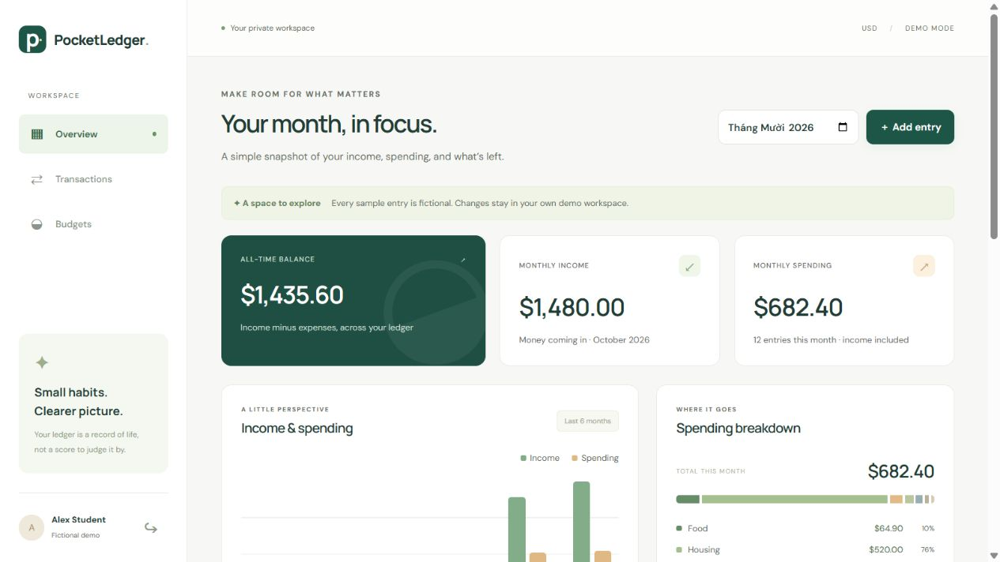
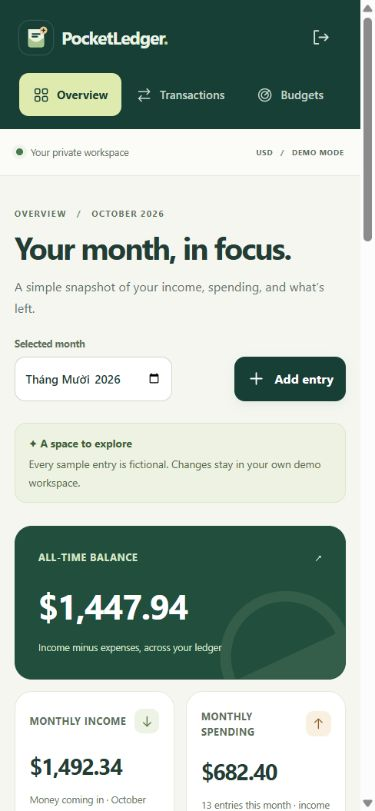

# PocketLedger

A private student budgeting workspace: record everyday income and expenses, plan monthly categories, and understand a month's spending without connecting a bank account.

Built with **React, TypeScript, Vite, Express, and SQLite**. It runs locally with one Node process in production; no paid API or cloud account is required.

## What works

- Signup/login with scrypt password hashing and database-backed cookie sessions.
- Income/expense create, edit and delete; every operation belongs to the signed-in user.
- Monthly/category transaction filters and CSV exports with spreadsheet formula protection.
- Monthly category budgets, spending progress and over-limit indicators.
- All-time balance, monthly income/spending/net and a six-month comparison.
- A separate fictional demo workspace for each visitor. No shared demo password.
- Responsive layout, keyboard modal focus/escape handling, accessible forms, error and empty states.

Amounts are stored as **integer cents**, never floating-point currency. API input is a decimal string (`"12.50"`), with a maximum of two decimal places. Calculations sum cents; display formatting happens at the edge.

## Run locally

Requires **Node.js 24+** and npm. SQLite comes from Node's built-in `node:sqlite` module; no database daemon or native npm database module is needed. Node may print a SQLite experimental warning on its 24.x release.

```sh
npm ci
# Copy .env.example to .env (optional with the default local ports).
npm run dev
```

Open **http://127.0.0.1:5174**. Vite forwards `/api` to the backend on 127.0.0.1:3002. Use the exact 127.0.0.1 URL because mutations check the configured browser origin. Keep the default backend port for development unless you also update the Vite proxy. `.env` is read by the backend, and is never committed.

Choose **Explore a private demo**, or create your own account for an empty workspace. Sample entries are labeled fictional and use the month selected in your browser, including near a timezone month boundary. Loading sample data into an existing account only works when its transaction and budget tables are empty; it never replaces existing records.

## Verify and run the build

```sh
npm test
npm run build
```

For a local build preview, set `APP_ORIGIN=http://127.0.0.1:3002` in your ignored `.env`, then run `npm start` and open that URL. The compiled Express server serves the Vite build and the API from the same origin. `npm start` requires the build first.

For an actual deployment, use `NODE_ENV=production`, an HTTPS `APP_ORIGIN`, `COOKIE_SECURE=true`, a persistent disk for `DATABASE_PATH`, and the appropriate `HOST` binding for the platform. Do not use an ephemeral filesystem for persistent records. This repository does not deploy itself.

## Architecture

```text
React / Vite UI → same-origin JSON API → Express validation and owned queries → SQLite
                                      ↳ scrypt auth / hashed cookie-session tokens / CSRF
```

`server/domain.ts` defines exact money/date rules and CSV escaping. `server/store.ts` owns parameterized queries, WAL persistence, schema creation and atomic demo seeding. `server/app.ts` provides authentication, ownership/CSRF enforcement, limits and HTTP error handling. `src/main.tsx` renders the dashboard, transaction and budget views.

SQLite creates tables automatically at startup. Foreign keys are enforced and WAL mode is enabled with a five-second busy timeout. Stop the server cleanly before copying the database for a simple backup; a live SQLite database can also have journal files. Keep backups private.

## Security and tests

Passwords use unique salts and Node scrypt. The browser receives an HttpOnly, SameSite=Strict cookie; Secure is enabled for production. Only the token hash is stored in SQLite. Authenticated mutations require a session CSRF token and JSON content. Provided Origin headers must match `APP_ORIGIN`. Authentication attempts are limited per IP in process memory. No session tokens are stored in localStorage.

The ten integration tests use temporary/in-memory databases and synthetic accounts. They cover exact cent arithmetic, input/date limits, hashing/session restoration/logout, concurrent duplicate signup, oversized requests, ownership for edit/delete/read/export, CSRF/origin checks, filters/budget totals, CSV formula protection and exports beyond the screen's 500-row limit, secure cookie flags/session expiration, isolated demos, requested demo months and rejected inputs without partial records, and persistence across SQLite reopen. Tests do not use real financial or account data. GitHub Actions runs the tests and production build on Node 24.

## Scope and limits

- USD only; no currency conversion, bank/payment connection, recurring entries or financial advice.
- Portfolio MVP for one application process on persistent disk. SQLite calls are synchronous; use a server database and distributed throttling for substantial traffic or multiple instances.
- Up to 10,000 transactions per workspace; list view shows the latest 500 matches, while CSV includes all matches. This cap also bounds integer totals within JavaScript's safe range.
- Cookie sessions expire after seven days. No email verification, password recovery, account deletion UI, audit-history or production monitoring service yet.
- Demo users persist in the local database; do not expose the demo endpoint to unbounded public traffic without a cleanup/quota policy. The endpoint has a five-attempt/15-minute IP limit.
- Development's in-memory IP limits reset with the process and do not coordinate across servers. Express proxy trust is disabled by default; configure and verify a trusted reverse proxy before depending on client-IP limits behind one.

## Portfolio talking points

Use the [five-minute demo guide](docs/DEMO_GUIDE.md) to walk through the product and explain its design decisions.

This project demonstrates end-to-end TypeScript development, HTTP API design, authentication and tenant isolation, exact money representation, practical SQLite persistence, accessibility and responsive UI, and adversarial integration testing. It does not claim users improved their financial outcomes.

Original application code and the pocket-and-ledger SVG mark are MIT licensed. The same lightweight original SVG is used in the app and as its favicon. All demo content is fictional; no personal data, credentials, bank data, or generated databases belong in the public repository. The interface uses system fonts and needs no external font or image service.

Primary implementation references: [Node SQLite](https://nodejs.org/docs/latest-v24.x/api/sqlite.html), [Node crypto](https://nodejs.org/docs/latest-v24.x/api/crypto.html), [Express security](https://expressjs.com/en/advanced/best-practice-security/).

## Screenshots

Captured from the compiled local application with fictional demo data after the October 2026 workspace and logo update.




